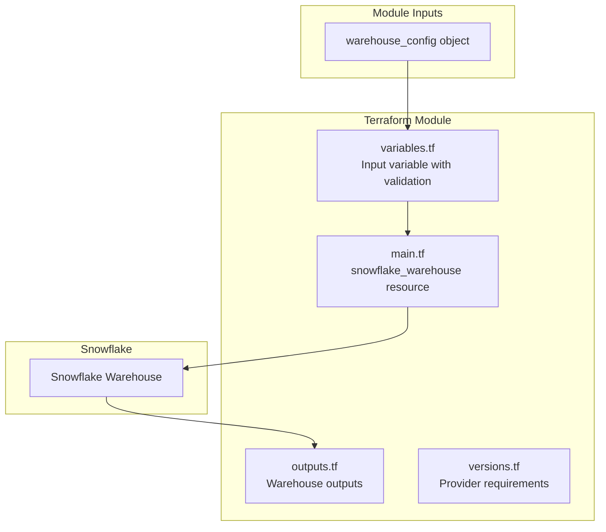

# Design Document: Snowflake Warehouse Module

## Overview

This document describes the technical design for a Terraform module that creates and manages Snowflake warehouses. The module accepts a single object variable containing all warehouse configuration properties and creates a `snowflake_warehouse` resource using the Snowflake-Labs/snowflake provider.

The module follows Terraform best practices for reusable modules:
- Single responsibility: creates one warehouse per module instance
- Configurable via a typed object variable
- Input validation using Terraform's built-in validation blocks
- Meaningful outputs for downstream resource references

## Architecture



## Components and Interfaces

### Component 1: Input Variable (variables.tf)

The module defines a single input variable `warehouse_config` as a typed object.

```hcl
variable "warehouse_config" {
  description = "Configuration object for the Snowflake warehouse"
  type = object({
    name                       = string
    warehouse_size             = optional(string, "X-SMALL")
    warehouse_type             = optional(string, "STANDARD")
    auto_resume                = optional(bool, true)
    auto_suspend               = optional(number, 60)
    initially_suspended        = optional(bool, true)
    min_cluster_count          = optional(number, 1)
    max_cluster_count          = optional(number, 1)
    scaling_policy             = optional(string, "STANDARD")
    enable_query_acceleration  = optional(bool, false)
    comment                    = optional(string, null)
  })

  validation {
    condition     = length(var.warehouse_config.name) > 0
    error_message = "Warehouse name must not be empty."
  }

  validation {
    condition = contains([
      "X-SMALL", "XSMALL", "SMALL", "MEDIUM", "LARGE", 
      "X-LARGE", "XLARGE", "2X-LARGE", "XXLARGE", "X2LARGE",
      "3X-LARGE", "XXXLARGE", "X3LARGE", "4X-LARGE", "X4LARGE",
      "5X-LARGE", "X5LARGE", "6X-LARGE", "X6LARGE"
    ], upper(var.warehouse_config.warehouse_size))
    error_message = "Invalid warehouse_size. Valid values: X-SMALL, SMALL, MEDIUM, LARGE, X-LARGE, 2X-LARGE, 3X-LARGE, 4X-LARGE, 5X-LARGE, 6X-LARGE."
  }

  validation {
    condition     = contains(["STANDARD", "SNOWPARK-OPTIMIZED"], upper(var.warehouse_config.warehouse_type))
    error_message = "Invalid warehouse_type. Valid values: STANDARD, SNOWPARK-OPTIMIZED."
  }

  validation {
    condition     = contains(["STANDARD", "ECONOMY"], upper(var.warehouse_config.scaling_policy))
    error_message = "Invalid scaling_policy. Valid values: STANDARD, ECONOMY."
  }

  validation {
    condition     = var.warehouse_config.auto_suspend >= 0
    error_message = "auto_suspend must be >= 0 seconds."
  }

  validation {
    condition     = var.warehouse_config.min_cluster_count <= var.warehouse_config.max_cluster_count
    error_message = "min_cluster_count must not exceed max_cluster_count."
  }
}
```

### Component 2: Warehouse Resource (main.tf)

The main resource definition creates the Snowflake warehouse using the configuration object.

```hcl
resource "snowflake_warehouse" "this" {
  name                        = var.warehouse_config.name
  warehouse_size              = var.warehouse_config.warehouse_size
  warehouse_type              = var.warehouse_config.warehouse_type
  auto_resume                 = var.warehouse_config.auto_resume
  auto_suspend                = var.warehouse_config.auto_suspend
  initially_suspended         = var.warehouse_config.initially_suspended
  min_cluster_count           = var.warehouse_config.min_cluster_count
  max_cluster_count           = var.warehouse_config.max_cluster_count
  scaling_policy              = var.warehouse_config.scaling_policy
  enable_query_acceleration   = var.warehouse_config.enable_query_acceleration
  comment                     = var.warehouse_config.comment
}
```

### Component 3: Outputs (outputs.tf)

The module exposes key warehouse attributes for downstream consumption.

```hcl
output "warehouse_name" {
  description = "The name of the created warehouse"
  value       = snowflake_warehouse.this.name
}

output "warehouse_fully_qualified_name" {
  description = "The fully qualified name of the warehouse"
  value       = snowflake_warehouse.this.fully_qualified_name
}

output "warehouse_size" {
  description = "The size of the warehouse"
  value       = snowflake_warehouse.this.warehouse_size
}

output "warehouse_state" {
  description = "The state of the warehouse (STARTED or SUSPENDED)"
  value       = snowflake_warehouse.this.initially_suspended ? "SUSPENDED" : "STARTED"
}
```

### Component 4: Provider Requirements (versions.tf)

```hcl
terraform {
  required_version = ">= 1.3.0"

  required_providers {
    snowflake = {
      source  = "Snowflake-Labs/snowflake"
      version = ">= 0.87.0"
    }
  }
}
```

## Data Models

### Warehouse Configuration Object

| Property | Type | Required | Default | Description |
|----------|------|----------|---------|-------------|
| name | string | Yes | - | Warehouse identifier |
| warehouse_size | string | No | "X-SMALL" | Size of the warehouse |
| warehouse_type | string | No | "STANDARD" | Type of warehouse |
| auto_resume | bool | No | true | Auto-resume on query submission |
| auto_suspend | number | No | 60 | Seconds before auto-suspend |
| initially_suspended | bool | No | true | Start in suspended state |
| min_cluster_count | number | No | 1 | Minimum clusters |
| max_cluster_count | number | No | 1 | Maximum clusters |
| scaling_policy | string | No | "STANDARD" | Scaling policy |
| enable_query_acceleration | bool | No | false | Enable query acceleration |
| comment | string | No | null | Warehouse description |

### Valid Warehouse Sizes

- X-SMALL (XSMALL)
- SMALL
- MEDIUM
- LARGE
- X-LARGE (XLARGE)
- 2X-LARGE (XXLARGE, X2LARGE)
- 3X-LARGE (XXXLARGE, X3LARGE)
- 4X-LARGE (X4LARGE)
- 5X-LARGE (X5LARGE)
- 6X-LARGE (X6LARGE)

### Valid Warehouse Types

- STANDARD
- SNOWPARK-OPTIMIZED

### Valid Scaling Policies

- STANDARD
- ECONOMY


## Correctness Properties

*A property is a characteristic or behavior that should hold true across all valid executions of a system—essentially, a formal statement about what the system should do. Properties serve as the bridge between human-readable specifications and machine-verifiable correctness guarantees.*

### Property 1: Configuration Passthrough

*For any* valid warehouse configuration object, all provided properties SHALL be correctly reflected in the created `snowflake_warehouse` resource attributes.

**Validates: Requirements 1.2, 2.1, 2.2, 2.3, 2.4, 2.5, 2.6, 2.7, 2.8, 2.9, 2.10, 2.11**

### Property 2: Default Value Application

*For any* warehouse configuration object with omitted optional properties, the module SHALL apply the specified default values (warehouse_size="X-SMALL", warehouse_type="STANDARD", auto_resume=true, auto_suspend=60, initially_suspended=true, min_cluster_count=1, max_cluster_count=1, scaling_policy="STANDARD", enable_query_acceleration=false).

**Validates: Requirements 1.3**

### Property 3: Valid Input Acceptance

*For any* warehouse configuration object where:
- name is a non-empty string
- warehouse_size is a valid size enum
- warehouse_type is a valid type enum
- scaling_policy is a valid policy enum
- auto_suspend >= 0
- min_cluster_count <= max_cluster_count

The module SHALL accept the configuration without validation errors.

**Validates: Requirements 1.1, 2.1**

### Property 4: Invalid Input Rejection

*For any* warehouse configuration object that violates any of the following constraints:
- name is empty or null
- warehouse_size is not in the valid sizes list
- warehouse_type is not in the valid types list
- scaling_policy is not in the valid policies list
- auto_suspend < 0
- min_cluster_count > max_cluster_count

The module SHALL reject the configuration with a descriptive validation error.

**Validates: Requirements 3.1, 3.2, 3.3, 3.4, 3.5, 3.6**

### Property 5: Output Correctness

*For any* successfully created warehouse, the module outputs SHALL correctly reflect:
- warehouse_name matches the input name
- warehouse_size matches the configured or default size
- warehouse_state reflects the initially_suspended setting

**Validates: Requirements 4.1, 4.2, 4.3, 4.4**

## Error Handling

### Validation Errors

The module uses Terraform's built-in validation blocks to provide clear error messages:

| Validation | Error Message |
|------------|---------------|
| Empty name | "Warehouse name must not be empty." |
| Invalid warehouse_size | "Invalid warehouse_size. Valid values: X-SMALL, SMALL, MEDIUM, LARGE, X-LARGE, 2X-LARGE, 3X-LARGE, 4X-LARGE, 5X-LARGE, 6X-LARGE." |
| Invalid warehouse_type | "Invalid warehouse_type. Valid values: STANDARD, SNOWPARK-OPTIMIZED." |
| Invalid scaling_policy | "Invalid scaling_policy. Valid values: STANDARD, ECONOMY." |
| Negative auto_suspend | "auto_suspend must be >= 0 seconds." |
| min > max cluster count | "min_cluster_count must not exceed max_cluster_count." |

### Provider Errors

Provider-level errors (authentication, permissions, API errors) are passed through from the Snowflake provider without modification. The module does not attempt to handle or wrap these errors.

## Testing Strategy

### Unit Tests

Unit tests verify specific examples and edge cases:

1. **Valid configuration acceptance**: Test that the example configuration from requirements is accepted
2. **Default value application**: Test that omitting optional properties results in correct defaults
3. **Boundary conditions**: Test auto_suspend=0, min_cluster_count=max_cluster_count
4. **All warehouse sizes**: Test each valid warehouse size value
5. **All warehouse types**: Test STANDARD and SNOWPARK-OPTIMIZED types

### Property-Based Tests

Property-based tests use Terraform's `terraform validate` and `terraform plan` commands to verify properties across generated configurations.

**Testing Framework**: Terratest (Go-based testing framework for Terraform)

**Property Test Configuration**:
- Minimum 100 iterations per property test
- Each test tagged with: **Feature: snowflake-warehouse-module, Property {N}: {property_text}**

#### Property Test 1: Configuration Passthrough
Generate random valid warehouse configurations and verify all properties appear in the plan output.

#### Property Test 2: Default Value Application
Generate configurations with various optional properties omitted and verify defaults in plan output.

#### Property Test 3: Valid Input Acceptance
Generate configurations within valid bounds and verify `terraform validate` succeeds.

#### Property Test 4: Invalid Input Rejection
Generate configurations with invalid values and verify `terraform validate` fails with appropriate error messages.

#### Property Test 5: Output Correctness
Generate valid configurations, run `terraform plan`, and verify output values match input configuration.

### Integration Tests

Integration tests require a Snowflake account and verify actual resource creation:

1. Create warehouse with minimal configuration
2. Create warehouse with full configuration (all properties specified)
3. Update warehouse configuration
4. Destroy warehouse

### Test File Structure

```
tests/
├── unit/
│   ├── valid_config_test.go
│   └── validation_test.go
├── property/
│   ├── passthrough_test.go
│   ├── defaults_test.go
│   ├── valid_input_test.go
│   ├── invalid_input_test.go
│   └── output_test.go
└── integration/
    └── warehouse_lifecycle_test.go
```
